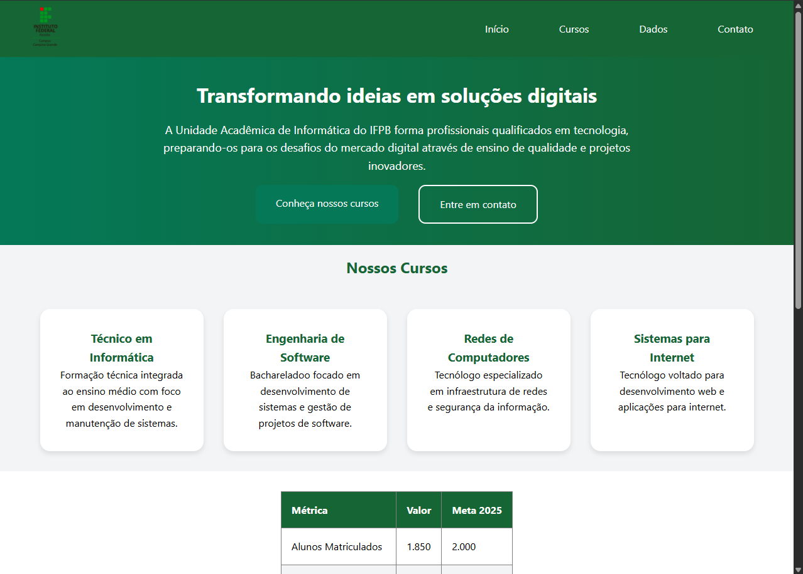
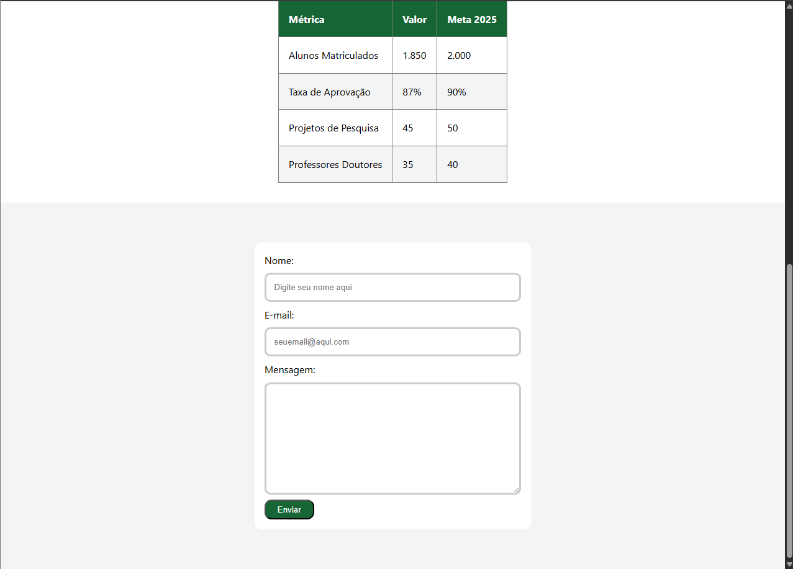

# 💻 Site Institucional - Unidade Acadêmica de Informática (IFPB)

Este projeto foi desenvolvido como parte de uma atividade prática da disciplina de **Programação para Web 1** do curso de Engenharia de Software no IFPB.

## 🚀 Sobre o Projeto
O objetivo foi criar uma página institucional utilizando apenas HTML5 e CSS3 puro, focando em conceitos de estruturação (Box Model), alinhamento (Flexbox e Grid) e semântica web.

## 🛠️ Tecnologias Utilizadas
* **HTML5:** Estrutura semântica da página.
* **CSS3:** Estilização, layouts com Flexbox/Grid e responsividade básica.

## 📸 Screenshots
Aqui estão alguns prints do resultado final:

### Navegação, Banner e Seção de Cursos (Grid)

### Formulário e Dados

## Requisitos Implementados
- [x] Comunicação Cliente-Servidor (Teoria)
- [x] Header com Flexbox
- [x] Banner Principal centralizado
- [x] Grid de Cursos com 4 colunas e efeito Hover
- [x] Tabela de métricas com cabeçalho estilizado
- [x] Formulário de contato com método POST e largura máxima de 500px

---
Desenvolvido por [Pedro Gomes de Andrade Neto] - Estudante de Engenharia de Software @ IFPB